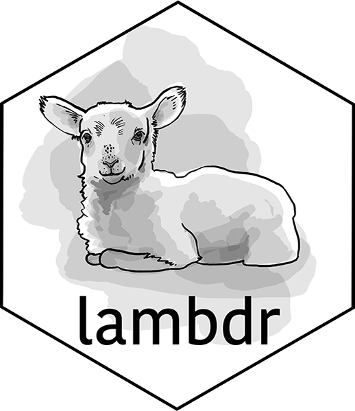

# lambdr 

<!-- badges: start -->
[](https://github.com/mdneuzerling/lambdr/actions)
[](https://cran.r-project.org/package=lambdr)
[](https://cran.r-project.org/package=lambdr)
[](https://github.com/mdneuzerling/lambdr/tree/main)
[](https://app.codecov.io/gh/mdneuzerling/lambdr?branch=main)
[](https://choosealicense.com/licenses/mit/)
<!-- badges: end -->

This package provides an R runtime interface client for the [_AWS Lambda_
serverless compute service](https://aws.amazon.com/lambda/). It makes it
possible to deploy code written in R as _Lambda functions_ when using container
images.

This package is **unofficial**. Its creators are not affiliated with
_Amazon Web Services_, nor is its content endorsed by _Amazon Web Services_.
_Lambda_, _API Gateway_, _EventBridge_, _CloudWatch_, and _SNS_ are services of
_Amazon Web Services_.

## The runtime

Any programming language can be used to create a container-based Lambda
function. All that's required is a language-specific runtime. AWS provides such
runtimes for a handful of languages, e.g. Python, Go, and Ruby - but not for R.

As a runtime for R, `lambdr`'s job is to coordinate the translation and transfer
of inputs/responses between the outside world and an invoked Lambda's `handler`
function.

The default behaviour is to convert the body of the received event from JSON
into arguments for the Lambda's `handler` function using the `jsonlite` package.

For example, a raw event body of `{"number": 9}` will be converted to
`list(number = 9)`. The handler function will then receive the arguments
directly after unlisting, eg. `number = 9`. This works for direct invocations,
as well as situations where the user wishes to implement behaviour specific to
a trigger.

Some invocation types have their own logic for converting the event body into
an R object. This is useful for say, using an R function in a Lambda behind
an API Gateway, so that the R function does not need to deal with the HTML
elements of the invocation. The below invocation types have custom logic
implemented. Refer to the vignettes or the package website for more
information.

Alternatively, user-defined functions can be provided for parsing event
content and serialising results. The user can also use the `identity`
function as a deserialiser to pass the raw event content --- as a string ---
to the handler function. Refer to `?lambda_config` for more information.

 invocation type | implementation stage
|:---------------|:---------------------|
 direct | 
 API Gateway (REST) | 
 API Gateway (HTML) | 
 EventBridge | 
 SNS | 

## Installation

The package can be installed from CRAN with:

```r
install.packages("lambdr")
```

The development version is available with:

```r
remotes::install_github("mdneuzerling/lambdr")
```

## Running

In a `runtime.R` file, source all functions needed and then run:

```{r}
lambdr::start_lambda()
```

This `runtime.R` file should be executed by the Docker image containing your
Lambda code.

The `lambdr::start_lambda()` function relies on environment variables
configured by AWS. It will fail if run locally. In particular, the _handler_ as
configured by the user through AWS will determine which function handles the
Lambda events. For debugging and testing, values can be provided to the function in the absence of environment variables. See `?lambdr::lambda_config` for
details.

## Example

Consider the following `runtime.R` file:

```r
parity <- function(number) {
  list(parity = if (as.integer(number) %% 2 == 0) "even" else "odd")
}

lambdr::start_lambda()
```

The `parity` function accepts a `number` argument and returns its parity as a named list, for example:

```r
parity(5)
# $parity
# [1] "odd"


parity(8)
# $parity
# [1] "even"
```

This function can then be placed into a Docker image. An **example** is provided below, but the key components are:

* Start from a minimal Rocker parent image
* Install package dependencies using `pak`, which also handles system dependencies.
* Copy across `runtime.R` and any other necessary files
* Set the handler as the `CMD`. The `lambdr` package interprets the handler as the name of the function to use, in this case, "parity". The `CMD` can also be set (or overriden) when setting up the Lambda in AWS.

```dockerfile
FROM docker.io/rocker/r-ver:4.4

# curl is required for {pak}
RUN apt-get update && apt-get -y install --no-install-recommends curl 

# options(warn=2) will make the build error out if package doesn't install
RUN Rscript -e "options(warn = 2); install.packages('pak')"

# Using {pak} to install R packages: it resolves Ubuntu system dependencies AND
# the R dependency tree. Other required packages can be installed here.
RUN Rscript -e "pak::pak('lambdr')"

RUN mkdir /R
COPY runtime.R /R
RUN chmod 755 -R /R

ENTRYPOINT Rscript R/runtime.R
CMD ["parity"]
```

The image is built and uploaded to AWS Elastic Container Registry (ECR). First, a repository is created:

```bash
aws ecr create-repository --repository-name parity-lambda --image-scanning-configuration scanOnPush=true
```

This provides a URI, the resource identifier of the created repository. The image can now be pushed:

```bash
docker build -f dockerfile -t r-on-lambda .   
docker tag mdneuzerling/r-on-lambda:latest {URI}/parity-lambda:latest
aws ecr get-login-password | docker login --username AWS --password-stdin {URI}
docker push {URI}/parity-lambda:latest
```

In either the AWS console or the command line, a Lambda can be created from this image. Call the Lambda "parity" to match the function name. Tests can be executed within the console. Alternatively the Lambda can be invoked from the CLI:

```bash
aws lambda invoke --function-name parity \
  --invocation-type RequestResponse --payload '{"number": 8}' \
  /tmp/response.json --cli-binary-format raw-in-base64-out
```

The output is now available in the generated file:

```bash
cat /tmp/response.json            
```

```bash
{"parity":"even"}
```

A detailed guide on how to create these Dockerfiles, as well as a guide for those new to Docker, can be found in the vignettes.

---

Hex logo by Phizz Leeder
