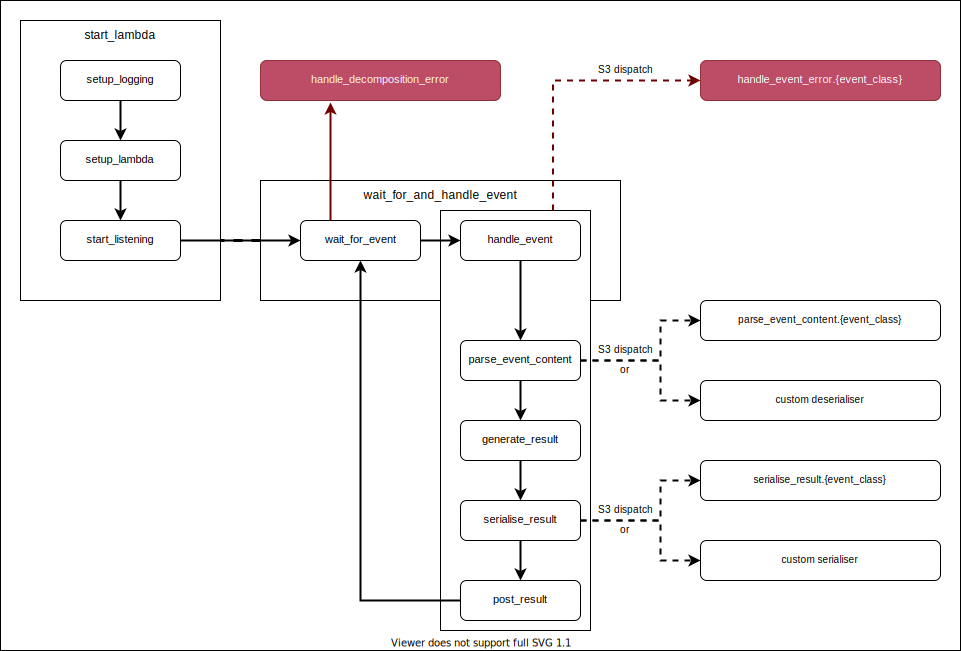

# lambdr

<!-- badges: start -->
[](https://cran.r-project.org/package=lambdr)
[](https://cran.r-project.org/package=lambdr)
[](https://github.com/mdneuzerling/lambdr/tree/main)
[](https://github.com/mdneuzerling/lambdr/actions)
[](https://codecov.io/gh/mdneuzerling/lambdr?branch=main)
[](https://choosealicense.com/licenses/mit/)
<!-- badges: end -->

Running R containers on AWS Lambda.

This package is in active development, and is not yet ready for use.

Not all invocation types have been implemented or tested.


 invocation type | implementation stage
|:---------------|:---------------------|
 direct | 
 API Gateway (REST) | 
 API Gateway (HTML) | 
 EventBridge | 
 SNS | 

## Installation

``` r
remotes::install_github("mdneuzerling/lambdr")
```

## Running

In a `runtime.R` file, source all functions needed and then run:

```{r}
lambdr::start_lambda()
```

This `runtime.R` file should be executed by the Docker image containing your
Lambda code.

The `lambdr::start_lambda()` function relies on environment variables
configured by AWS. It will fail if run locally. In particular, the _handler_ as
configured by the user through AWS will determine which function handles the
Lambda events. For debugging and testing, values can be provided to the function in the absence of environment variables. See `?lambdr::start_lambda` for
details.

## Example

Consider the following `runtime.R` file:

```r
parity <- function(number) {
  list(parity = if (as.integer(number) %% 2 == 0) "even" else "odd")
}

lambdr::start_lambda(log_threshold = logger::DEBUG)
```

The `parity` function accepts a `number` argument and returns its parity as a named list, for example:

```r
parity(5)
# $parity
# [1] "odd"


parity(8)
# $parity
# [1] "even"
```

This function can then be placed into a Docker image. An **example** is provided below, but the key components are:

* Start from the `public.ecr.aws/lambda/provided` parent image, which provides the basic components necessary to serve a Lambda
* Install R and dependencies, both system dependencies and R packages, including the `lambdr` package
* Copy across `runtime.R` and any other necessary files
* Generate a simple bootstrap which runs `runtime.R` with R
* Set the handler as the `CMD`. The `lambdr` package interprets the handler as the name of the function to use, in this case, "parity". The `CMD` can also be set (or overriden) when setting up the Lambda in AWS.

```dockerfile
FROM public.ecr.aws/lambda/provided

ENV R_VERSION=4.0.3

RUN yum -y install wget git tar

RUN yum -y install https://dl.fedoraproject.org/pub/epel/epel-release-latest-7.noarch.rpm \
  && wget https://cdn.rstudio.com/r/centos-7/pkgs/R-${R_VERSION}-1-1.x86_64.rpm \
  && yum -y install R-${R_VERSION}-1-1.x86_64.rpm \
  && rm R-${R_VERSION}-1-1.x86_64.rpm

ENV PATH="${PATH}:/opt/R/${R_VERSION}/bin/"

# System requirements for R packages
RUN yum -y install openssl-devel

RUN Rscript -e "install.packages(c('httr', 'jsonlite', 'logger', 'remotes'), repos = 'https://packagemanager.rstudio.com/all/__linux__/centos7/latest')"
RUN Rscript -e "remotes::install_github('mdneuzerling/lambdr')"

RUN mkdir /lambda
COPY runtime.R /lambda
RUN chmod 755 -R /lambda

RUN printf '#!/bin/sh\ncd /lambda\nRscript runtime.R' > /var/runtime/bootstrap \
  && chmod +x /var/runtime/bootstrap

CMD ["parity"]
```

The image is built and uploaded to AWS Elastic Container Registry (ECR). First, a repository is created:

```bash
aws ecr create-repository --repository-name parity-lambda --image-scanning-configuration scanOnPush=true
```

This provides a URI, the resource identifier of the created repository. The image can now be pushed:

```bash
docker tag mdneuzerling/r-on-lambda:latest {URI}/parity-lambda:latest
aws ecr get-login-password | docker login --username AWS --password-stdin {URI}
docker push {URI}/parity-lambda:latest
```

In either the AWS console or the command line, a Lambda can be created from this image. Call the Lambda "parity" to match the function name. Tests can be executed within the console. Alternatively the Lambda can be invoked from the CLI:

```bash
aws lambda invoke --function-name parity \
  --invocation-type RequestResponse --payload '{"number": 8}' \
  /tmp/response.json --cli-binary-format raw-in-base64-out
```

The output is now available in the generated file:

```bash
cat /tmp/response.json            
```

```bash
{"parity":"even"}
```

## Package structure and operating method

### Runtime endpoints

The runtime works by querying HTTP endpoints configured by AWS Lambda.
These endpoints are determined by on the "AWS_LAMBDA_RUNTIME_API" environment
variable set by AWS Lambda during initialisation. They generally won't be
available locally.

* The **next invocation endpoint** is the endpoint which R must query for
  the next input. R must send a `GET` request to this endpoint and will wait
  until either a response is received or the Lambda instance is shut down for
  inactivity. When AWS Lambda receives an input from, say, an API Gateway, it
  will respond to R's request with details of the input. We call the response to
  this request an _invocation_ in this document, and invocations are interpreted
  as _events_.
* The **initialisation error endpoint** is where an error should be sent if
  the error occurs when setting up the runtime. This is distinct from errors 
  that occur during handling of an event.
* The **response endpoint** is where an event response should be sent. It is
  unique for each event.
* The **invocation error endpoint** is where errors that occur during event
  handling should be reported. It is unique for each event.

The next invocation and initialisation error endpoints are unique in each Lambda 
instance. The response and invocation error endpoints are determined by the
`request_id` associated with each invocation. The request ID is given in the
"lambda-runtime-aws-request-id" header in the response to the query to the
next invocation endpoint.

### Handler functions

Every Lambda instance is centred around a single function which handles any
inputs. The _handler function_ is determined by an environment variable which
can be configured in one of two ways:

* as the `CMD` to the Dockerfile which contains the runtime, or
* as configured through the Lambda console (this takes precedence)

The `lambda_config` function (run as part of `start_lambda`) picks up on this
environment variable and identifies the R function to which it refers. This
handler function is used to process all invocations.

### Event classification according to invocation

Events need to be handled differently depending upon whether they are invoked
directly, by an API Gateway, etc. Events are classified according to their
detected invocation method, with their invocation stored as an S3 class. The
following functions dispatch on this class:

* `parse_event_content` converts the raw event content into arguments to be
  passed to the handler function
* `seralise_result` converts the result into the form that will be sent back to
  Lambda
* `extract_context` extracts metadata about the event as a list. If the handler
  function accepts a named `context` argument then it will receive the context
  as a value to that argument.
* `handle_event_error` deals with errors that occur during event handling. Some 
  invocation types require errors to be formatted or handled in a very specific
  way.

### Event listening lifecycle

The main function --- `start_lambda` --- runs three functions in sequence:

* `setup_logging`
* `lambda_config`
* `start_listening`

The `start_listening` function sets up an infinite loop that listens for
_invocations_, interprets them as _events_, and processes them with the handler 
function. 

`start_listening` triggers the listening loop, which consists of
`wait_for_event` and `handle_event` (combined into `wait_for_and_handle_event`).
Once a response (called an _invocation_) is sent to the request made in 
`wait_for_event`, it is _decomposed_ into an _event_, and classified according
to its (detected) invocation type.

If an error occurs during this stage it is handled by
`handle_decomposition_error`. Ifpossible the error will be posted to the error invocation endpoint so that Lambda can process it, but otherwise it will simply
be logged and then the runtime will move onto the next invocation.

The event is passed to `handle_event` which consists of the following steps:

* `parse_event_content` interprets the event content as arguments to be handed
  to the handler function. The user can also provide a function to the
  `deseraliser` argument of `start_listening` (or `start_lambda`), which will
  override the standard parsing logic.
* `generate_result` passes these arguments to the handler function and generates
  a result.
* `seralise_result` converts the result into the response that will be sent to
  Lambda. The user can also provide a function to the `serialiser` argument of
  `start_listening` (or `start_lambda`), which will override the standard
  serialisation logic.
* `post_result` posts the serialised result to the response endpoint.

Afterwards, the runtime will return to the `wait_for_event` function and process
the next invocation that arrives. AWS Lambda may shut down the instance if it
times out before another event invocation arrives.

Alternatively, if an error occurs during `wait_for_event` it will be handled
by `handle_decomposition_error`, or if it occurs during `handle_event` it will
be dispatched to the appropriate `handle_event_error` method according to the S3
class of the event. In either case this will not stop the R session --- an error
when processing a single event is a problem for that event alone. The runtime
will return to the `wait_for_event` step.

All of these functions are diagrammed below, with boxes representing functions
which are grouped together according to the primary function that calls each
of them in sequence. Errors are shown in red.


